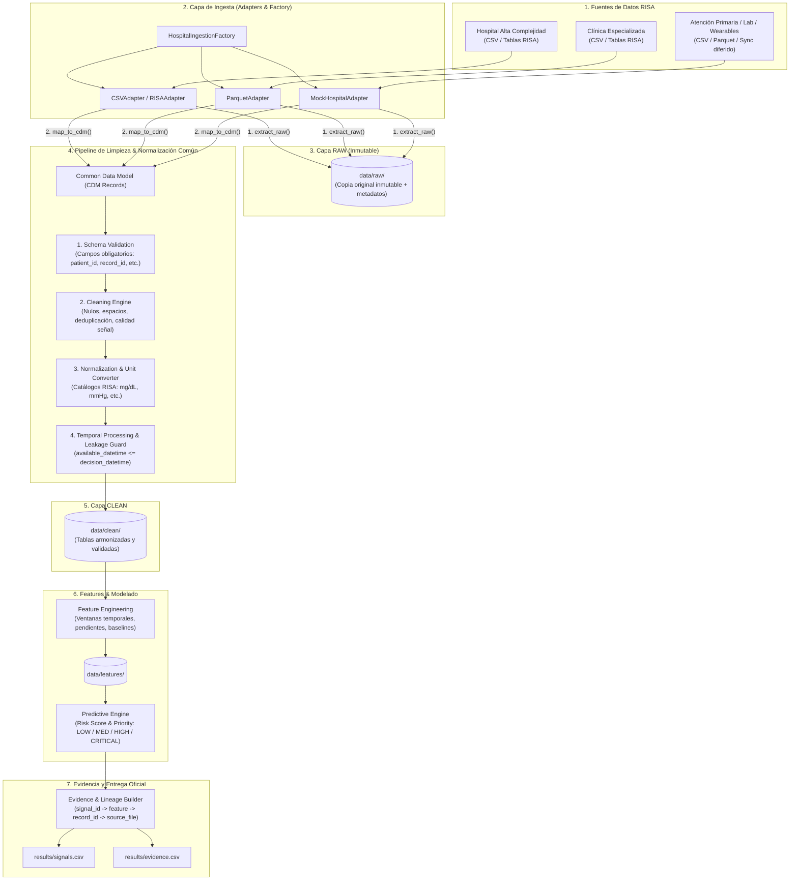
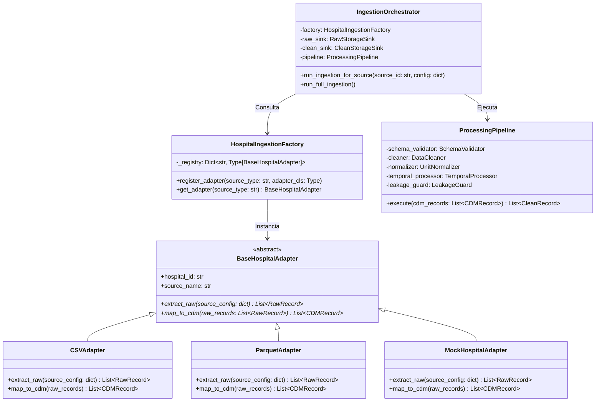

# Arquitectura y Diseño del Sistema de Ingesta y Procesamiento de Datos

**Proyecto:** HealthSignal LATAM — Red Integrada de Salud Avanzada (RISA Data V1.0)  
**Módulo:** Ingesta de Datos, Pipeline de Calidad, Integración y Trazabilidad  
**Documento:** `02_Arquitectura_Sistema_Ingesta.md`  
**Estado:** Especificación Arquitectónica Oficial (Revisión Corregida con Base en `corrección.md`)  

---

## 1. Visión General y Alineación con HealthSignal LATAM

El sistema resuelve la heterogeneidad, dispersión y calidad desigual de los datos generados por $N$ instituciones de salud (hospitales de alta complejidad, clínicas especializadas, centros de atención primaria, laboratorios, monitoreo wearable y telemonitoreo).

El objetivo primordial no es solo la ingeniería de datos, sino habilitar un flujo **robusto, sin fuga temporal (*temporal leakage*), auditable y de alta trazabilidad** que alimente directamente el pipeline predictivo para generar las salidas requeridas (`signals.csv` y `evidence.csv`) y provea servicio a la API/Dashboard de toma de decisiones clínicas.

### Flujo End-to-End del Sistema

```text
                  FUENTES RISA (N Hospitales / Centros)
                                  │
                                  ▼
                        INGESTION ADAPTERS
                      (extract_raw + map_to_cdm)
                                  │
                  ┌───────────────┴───────────────┐
                  ▼                               ▼
            data/raw/ (Inmutable)            CDM RECORDS
                                                  │
                                                  ▼
                                          SCHEMA VALIDATION
                                                  │
                                                  ▼
                                               CLEANING
                                                  │
                                                  ▼
                                            NORMALIZATION
                                                  │
                                                  ▼
                                         TEMPORAL PROCESSING
                                         (event vs available)
                                                  │
                                                  ▼
                                          data/clean/ (CLEAN)
                                                  │
                                                  ▼
                                         FEATURE ENGINEERING
                                                  │
                                                  ▼
                                            data/features/
                                                  │
                                                  ▼
                                           PREDICTIVE MODEL
                                                  │
                                                  ▼
                                              RISK SCORE
                                                  │
                                                  ▼
                                            PRIORITIZATION
                                                  │
                                                  ▼
                                          EVIDENCE + EXPLAIN
                                                  │
                                                  ▼
                                      results/signals.csv
                                      results/evidence.csv
                                                  │
                                                  ▼
                                               FASTAPI
                                                  │
                                                  ▼
                                            REACT DASHBOARD
```

---

## 2. Diagramas de Arquitectura (Mermaid)

### 2.1 Flujo de Datos y Capas de Persistencia

El flujo garantiza que la capa **RAW** almacene una copia exacta e inmutable de los datos de origen **antes** de cualquier transformación o limpieza, manteniendo la auditabilidad requerida por la guía técnica de RISA.



---

### 2.2 Diagrama de Clases: Ingesta Desacoplada (Evitando God Objects)

Se simplifican las responsabilidades de los adaptadores y se distribuye la orquestación:



---

## 3. Especificación Detallada del Componente de Ingesta de Datos

Esta sección describe a profundidad el diseño e implementación del **componente de ingesta**, el cual es la base técnica del sistema.

### 3.1 Responsabilidad Atómica de los Adaptadores (Factory Pattern Pragmático)

Para evitar duplicidad y divergencia en las reglas de negocio, los adaptadores **no ejecutan limpieza, ni conversión de unidades, ni validaciones de calidad**. Su única función es:
1. **`extract_raw(source_config)`**: Leer el formato de origen del hospital (archivos CSV, tablas RISA, Parquet) y generar una copia inmutable en `data/raw/` con metadatos de auditoría (`source_file`, `ingestion_datetime`, `raw_payload`).
2. **`map_to_cdm(raw_records)`**: Transformar los nombres de columnas y tipos nativos al **Common Data Model (CDM)** canónico.

#### Adaptadores Implementados en Fase Inicial:
* **`CSVAdapter`**: Adaptador universal optimizado para cargar los archivos tabulares del dataset oficial de RISA Data V1.0.
* **`ParquetAdapter`**: Adaptador columnar para ingesta eficiente de grandes volúmenes (ej. datos de alta frecuencia de wearables).
* **`MockHospitalAdapter`**: Adaptador sintético para pruebas unitarias y de estrés sin depender de archivos de disco.
* *Extensibilidad futura*: La interfaz queda lista para adaptadores SQL/FHIR en fases posteriores sin modificar el pipeline.

---

### 3.2 Common Data Model (CDM) Abstrato

El modelo común define el contrato unificado al que todos los adaptadores traducen los registros fuente:

| Campo | Tipo | Obligatorio | Descripción / Regla RISA |
|---|---|:---:|---|
| `record_id` | `str` / `int` | **Sí** | Identificador original del registro en la fuente para trazabilidad y joins |
| `hospital_id` | `str` | **Sí** | Código institucional de la fuente (ej. `HOSP_ALTA_COMP`, `CLIN_ESPEC`, `AMBULATORY`) |
| `patient_id` | `str` | **Sí** | Identificador del paciente en la red RISA (conservado íntegro) |
| `source_file` | `str` | **Sí** | Nombre del archivo fuente de RISA (ej. `vitals.csv`, `labs.csv`, `wearables.csv`) |
| `variable_code` | `str` | **Sí** | Código de la variable médica (ej. `HR`, `SPO2`, `SYS_BP`, `GLUCOSE`, `TEMP`, `RR`) |
| `value_numeric` | `Optional[float]` | No | Valor cuantitativo numérico |
| `value_text` | `Optional[str]` | No | Valor cualitativo o estado textual |
| `original_unit` | `Optional[str]` | No | Unidad de medida tal como viene en la fuente |
| `event_datetime` | `datetime` | **Sí** | Momento fisiológico real en que ocurrió la medición |
| `available_datetime` | `datetime` | **Sí** | Momento operacional en que el dato estuvo disponible en el sistema |
| `quality_indicator`| `Optional[str]` | No | Flag original de calidad de señal emitido por el dispositivo o laboratorio |

---

### 3.3 Pipeline de Procesamiento, Limpieza y Calidad

El pipeline común opera secuencialmente sobre los registros CDM desacoplado de las fuentes:

```text
[CDM Records]
      │
      ▼
1. Schema Validation    ──► Comprueba presencia obligatoria de: patient_id, record_id,
                            variable_code, event_datetime, available_datetime.
      │
      ▼
2. Data Cleaning        ──► Deduplicación por (record_id, source_file), strip de textos,
                            tratamiento de nulos (Missingness != 0, sin imputaciones ciegas).
      │
      ▼
3. Normalization        ──► Conversión de unidades al catálogo estándar RISA
                            (ej. Fahrenheit -> Celsius, mg/dL -> mmol/L).
      │
      ▼
4. Temporal Processing  ──► Ordenamiento cronológico de eventos y registro de latencias
                            (latencia = available_datetime - event_datetime).
      │
      ▼
5. Leakage Guard        ──► Validador estricto anti-fuga temporal:
                            Garantiza que available_datetime <= decision_datetime.
      │
      ▼
[CLEAN Dataset]         ──► Guardado estructurado en data/clean/ (Parquet / SQLite).
```

#### Reglas de Calidad Clave:
* **Control de Missingness**: Un dato faltante (`None` / `NaN`) nunca se convierte arbitrariamente en `0` ni en un valor "normal". Se preserva su condición para que la capa de features pueda evaluar ratios de completitud y calidad.
* **Leakage Guard**: En cualquier punto de decisión $T$, se bloquea el acceso a cualquier registro con `available_datetime > T`, incluso si `event_datetime <= T`.

---

### 3.4 Orquestador de Ingesta (`IngestionOrchestrator`)

En lugar de un servicio concentrador monolítico, `IngestionOrchestrator` coordina componentes especializados:

1. **Lectura y Registro**: Consulta la configuración de fuentes activas y obtiene el adaptador mediante `HospitalIngestionFactory.get_adapter(source_type)`.
2. **Copia RAW Inmutable**: Invoca `adapter.extract_raw()` y envía el resultado inmediatamente a `RawStorageSink` para persistencia en `data/raw/`.
3. **Mapeo a CDM**: Invoca `adapter.map_to_cdm()` obteniendo objetos `CDMRecord`.
4. **Ejecución del Pipeline**: Envía los registros al `ProcessingPipeline` (Validación $\rightarrow$ Limpieza $\rightarrow$ Normalización $\rightarrow$ Temporal $\rightarrow$ Leakage Guard).
5. **Persistencia CLEAN**: Escribe los registros procesados en `CleanStorageSink` (`data/clean/`).

---

## 4. Trazabilidad de Evidencia y Linaje (Cadena Oficial)

Para satisfacer los requisitos de auditoría y los archivos oficiales de salida (`signals.csv` y `evidence.csv`):

```text
DATO FUENTE (source_file, record_id)
      │
      ▼
REGISTRO LIMPIO (patient_id, available_datetime, clean_value)
      │
      ▼
FEATURE DERIVADA (ej. HR_mean_30m, SpO2_trend_negative, missing_ratio)
      │
      ▼
SEÑAL DE RIESGO (signal_id, risk_score, priority_level, decision_datetime)
      │
      ▼
EVIDENCIA VINCULADA (signal_id <-> record_id, evidence_role: PRIMARY / SUPPORTING / CONTEXT / QUALITY)
```

Cada predicción en `signals.csv` se vincula a los registros fuente en `evidence.csv` con su rol respectivo, cumpliendo estrictamente la condición:
$$\text{evidence.available\_datetime} \le \text{signal.decision\_datetime}$$

---

## 5. Distribución de Archivos del Proyecto Completo

Estructura integral y modular del proyecto:

```text
healthsignal/
│
├── app/                                  # API FastAPI y Controladores
│   ├── main.py                           # Punto de entrada de la API
│   ├── api/
│   │   ├── patients.py                   # Endpoints de consulta de pacientes y timeline
│   │   ├── signals.py                    # Endpoints de señales de riesgo detectadas
│   │   └── evidence.py                   # Endpoints de trazabilidad y evidencia
│   ├── services/
│   │   ├── patient_service.py
│   │   ├── signal_service.py
│   │   └── prediction_service.py
│   └── schemas/                          # Schemas Pydantic para responses/requests
│       ├── patient.py
│       ├── signal.py
│       └── evidence.py
│
├── ingestion/                            # MÓDULO DE INGESTA DE DATOS
│   ├── __init__.py
│   ├── base_adapter.py                   # Clase abstracta BaseHospitalAdapter
│   ├── factory.py                        # HospitalIngestionFactory (Registro dinámico)
│   ├── csv_adapter.py                    # Adaptador para datasets CSV de RISA
│   ├── parquet_adapter.py                # Adaptador para cargas masivas Parquet
│   ├── mock_adapter.py                   # Adaptador para simulación y pruebas
│   ├── mapper.py                         # Mapeo de columnas fuente -> CDM
│   ├── orchestrator.py                   # IngestionOrchestrator
│   └── sinks.py                          # RawStorageSink y CleanStorageSink
│
├── pipeline/                             # PIPELINE COMÚN DE PROCESAMIENTO & CALIDAD
│   ├── __init__.py
│   ├── validation.py                     # Validación de esquema inicial y reglas de negocio
│   ├── cleaning.py                       # Deduplicación, nulos y calidad de señal
│   ├── normalization.py                  # Conversión de unidades a estándar RISA
│   ├── temporal.py                       # Alineación temporal y cálculo de latencias
│   └── leakage_guard.py                  # Prevención de fuga temporal (available <= decision)
│
├── features/                             # CAPA DE FEATURE ENGINEERING
│   ├── __init__.py
│   ├── vital_features.py                 # Ventanas móviles, pendientes, variabilidad de signos vitales
│   ├── lab_features.py                   # Deltas y anomalías en resultados de laboratorio
│   ├── wearable_features.py              # Agregaciones de series temporales de wearables
│   ├── temporal_features.py              # Latencias y tiempo transcurrido desde última observación
│   ├── baseline_features.py              # Desviación respecto al baseline individual del paciente
│   ├── quality_features.py               # Ratios de missingness e índices de calidad de señal
│   └── feature_builder.py                # Orquestador y generador de matrices de features
│
├── model/                                # MODELADO PREDICTIVO Y PRIORIZACIÓN
│   ├── __init__.py
│   ├── train.py                          # Entrenamiento de modelos de riesgo
│   ├── predict.py                        # Inferencia temporal y cálculo de risk_score [0, 1]
│   ├── prioritization.py                 # Clasificación en niveles (LOW / MEDIUM / HIGH / CRITICAL)
│   ├── evaluate.py                       # Evaluación de métricas sin leakage
│   └── artifacts/                        # Modelos serializados (.pkl, .onnx)
│
├── evidence/                             # TRAZABILIDAD, LINAJE Y EXPLICABILIDAD
│   ├── __init__.py
│   ├── evidence_builder.py               # Generación de evidence.csv vinculando features y records
│   ├── lineage.py                        # Grafo de trazabilidad (signal -> feature -> record_id)
│   └── explanation_builder.py            # Generación de explicaciones clínicas verificables
│
├── data/                                 # ALMACENAMIENTO ESTRUCTURADO LOCAL
│   ├── raw/                              # Copias inmutables de archivos originales
│   ├── clean/                            # Datos limpios y normalizados en formato CDM
│   ├── features/                         # Matrices de características calculadas
│   └── catalogs/                         # Catálogos oficiales de unidades y variables RISA
│
├── results/                              # ENTREGABLES OFICIALES DEL RETO
│   ├── signals.csv                       # Salida oficial de señales de riesgo priorizadas
│   └── evidence.csv                      # Salida oficial de evidencia trazable asociada
│
├── frontend/                             # Dashboard React / Vite para visualización clínica
│
├── tests/                                # SUITE DE PRUEBAS AUTOMATIZADAS
│   ├── test_ingestion.py                 # Pruebas de adaptadores y factory
│   ├── test_pipeline.py                  # Pruebas de validación, limpieza y normalización
│   ├── test_leakage.py                   # Pruebas de prevención de fuga temporal
│   ├── test_features.py                  # Pruebas de cálculo de características
│   └── test_evidence.py                  # Pruebas de integridad de signals y evidence
│
├── run_pipeline.py                       # Script principal de ejecución end-to-end
├── validate_submission.py                # Validador oficial del formato de entrega
├── requirements.txt                      # Dependencias del proyecto
└── README.md                             # Guía de reproducción y arquitectura
```

---

## 6. Plan de Implementación Incremental

Para asegurar máxima velocidad y validar cada etapa antes de avanzar, el desarrollo se divide en 4 fases estructuradas:

### 🎯 Fase 1: Núcleo de Ingesta, RAW, Pipeline de Limpieza y CLEAN (Objetivo Inmediato)
Enfocada exclusivamente en construir la base de datos sólida y auditable:
1. **Modelos y Adaptadores**:
   - `ingestion/base_adapter.py` (interfaz con `extract_raw` y `map_to_cdm`).
   - `ingestion/factory.py` y `ingestion/csv_adapter.py`.
   - `ingestion/mapper.py` y `ingestion/sinks.py`.
2. **Pipeline de Calidad**:
   - `pipeline/validation.py` (Schema Validation).
   - `pipeline/cleaning.py` (Missingness, deduplicación).
   - `pipeline/temporal.py` (Timelines).
3. **Persistencia y Ejecución Inicial**:
   - Carpetas `data/raw/` y `data/clean/`.
   - `run_pipeline.py` para ejecutar el flujo:
     $$\text{CSV RISA} \longrightarrow \text{RAW (Inmutable)} \longrightarrow \text{CDM} \longrightarrow \text{Validación} \longrightarrow \text{Limpieza} \longrightarrow \text{CLEAN}$$

---

### Fase 2: Feature Engineering & Temporal Leakage Guard
Una vez que los datos limpios están garantizados:
1. `pipeline/leakage_guard.py` (Filtro temporal estricto: $T_{\text{available}} \le T_{\text{decision}}$).
2. Módulos de `features/` (`vital_features.py`, `lab_features.py`, `temporal_features.py`, `quality_features.py`, `feature_builder.py`).
3. Almacenamiento en `data/features/`.

---

### Fase 3: Modelo Predictivo, Priorización y Trazabilidad de Evidencia
1. `model/predict.py` y `model/prioritization.py` (Generación de `risk_score` y `priority_level`).
2. `evidence/evidence_builder.py` y `evidence/lineage.py` (Construcción del grafo de auditoría).
3. Generación y validación de `results/signals.csv` y `results/evidence.csv` con `validate_submission.py`.

---

### Fase 4: API de Servicios y Dashboard Clínico
1. `app/` (Servicio FastAPI para consulta de pacientes, señales de riesgo y linaje de evidencia).
2. `frontend/` (Dashboard interactivo para evaluación y demostración clínica).
