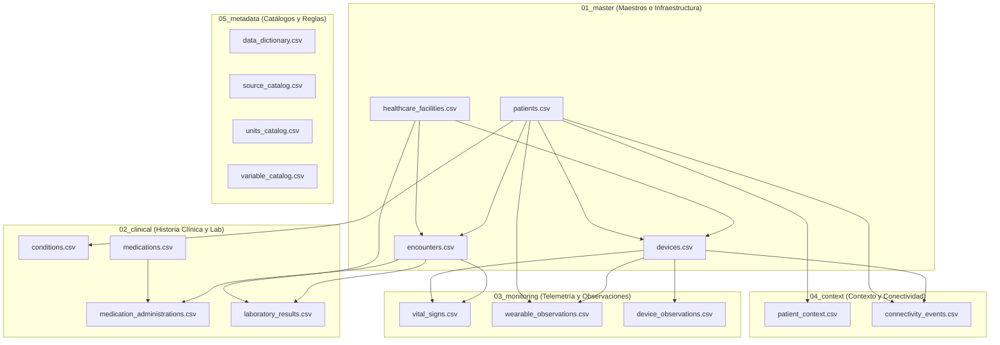

# Arquitectura del Modelo de Datos — RISA Data V1.0

**Proyecto:** HealthSignal LATAM — Red Integrada de Salud Avanzada  
**Documento:** `03_Arquitectura_Base_de_Datos_RISA.md`  
**Estado:** Especificación Oficial del Esquema de Datos y Puntos de Control de Calidad  

---

## 1. Visión General del Modelo RISA Data V1.0

El conjunto de datos **RISA Data V1.0** representa una red de salud integrada latinoamericana conformada por instituciones con distintos niveles de madurez digital, perfiles de conectividad y capacidades de monitoreo.

El dataset se organiza en **5 dominios estructurados** con un total de **17 archivos CSV**:



---

## 2. Esquema Detallado por Tabla y Tipos de Datos

### 2.1 Dominio `01_master` (Maestros)

#### `patients.csv` (1,000 registros)
Entidad central de pacientes en la red RISA.
* **PK:** `patient_id` (`string`, ej. `PAT-0001`)
* **Campos:** `patient_id`, `sex_at_birth` (`M`/`F`), `age_years` (`int`), `age_group` (`18-39`, `40-59`, `60-74`, `75+`), `region_type` (`URBAN`, `PERIURBAN`, `RURAL`), `care_program` (`AMBULATORY`, `HOME_MONITORING`, `POST_DISCHARGE`, `GENERAL_FOLLOWUP`), `baseline_risk_profile` (`GENERAL`, `METABOLIC_CONTEXT`, `OLDER_ADULT_CONTEXT`), `enrollment_date` (`date`), `active` (`bool`).

#### `healthcare_facilities.csv` (7 centros de salud)
Centros que emiten y recopilan datos clínicos y de monitoreo.
* **PK:** `facility_id` (`string`, ej. `FAC-01` a `FAC-07`)
* **Campos:** `facility_id`, `facility_name`, `facility_type` (`HOSPITAL`, `CLINIC`, `PRIMARY_CARE`, `HOME_MONITORING`, `LABORATORY`, `TELEMONITORING_CENTER`), `region_type`, `digital_maturity` (`HIGH`, `MEDIUM_HIGH`, `MEDIUM`, `MEDIUM_LOW`, `VARIABLE`), `connectivity_profile` (`STABLE`, `INTERMITTENT`, `VARIABLE`), `monitoring_capability` (`CONTINUOUS`, `PERIODIC`, `SPOT`, `REMOTE`, `NONE`), `laboratory_capability` (`FULL`, `STANDARD`, `BASIC`, `NONE`).

#### `devices.csv` (2,000 dispositivos)
Monitores clínicos y pulseras wearables asignadas.
* **PK:** `device_id` (`string`, ej. `DEV-00001`, `WRB-00001`)
* **FK:** `facility_id` $\rightarrow$ `healthcare_facilities.facility_id`, `assigned_patient_id` $\rightarrow$ `patients.patient_id`.
* **Campos:** `device_id`, `device_type` (`HOME_MONITOR`, `WRIST_WEARABLE`), `manufacturer_class`, `model_family`, `measurement_domain`, `sampling_profile`, `reliability_class` (`R1_HIGH`, `R2_STANDARD`, `R3_VARIABLE`), `facility_id`, `patient_assignment_type`, `active`, `assigned_patient_id`.

#### `encounters.csv` (1,000 episodios)
Episodios de atención u hospitalización/monitoreo domiciliario.
* **PK:** `encounter_id` (`string`, ej. `ENC-000001`)
* **FK:** `patient_id` $\rightarrow$ `patients.patient_id`, `facility_id` $\rightarrow$ `healthcare_facilities.facility_id`.
* **Campos:** `encounter_id`, `patient_id`, `facility_id`, `encounter_type` (`HOSPITAL_OBSERVATION`, `HOME_MONITORING_EPISODE`), `start_datetime` (`datetime`), `end_datetime` (`datetime`), `care_setting` (`HOME`, `FACILITY`), `reason_category`, `source_system` (`EHR_CORE`), `status` (`COMPLETED`).

---

### 2.2 Dominio `02_clinical` (Historia Clínica y Laboratorio)

#### `conditions.csv` (1,485 registros)
Antecedentes patológicos y diagnósticos activos.
* **PK:** `condition_id` (`string`, ej. `COND-000001`)
* **FK:** `patient_id` $\rightarrow$ `patients.patient_id`.
* **Campos:** `condition_id`, `patient_id`, `condition_category` (`CARDIOVASCULAR_HISTORY`, `RESPIRATORY_HISTORY`, `METABOLIC_HISTORY`, `RENAL_HISTORY`, `NO_MAJOR_RECORDED_HISTORY`), `onset_date` (`date`), `status` (`ACTIVE`, `RECORDED`), `severity_context`, `source_system` (`EHR_CORE`), `recorded_datetime` (`datetime`).

#### `medications.csv` (5 clases farmacológicas)
Catálogo de medicamentos base.
* **PK:** `medication_id` (`string`, ej. `MED-001` a `MED-005`)
* **Campos:** `medication_id`, `medication_class` (`RATE_MODIFYING`, `RESPIRATORY_SUPPORT`, `ANTIPYRETIC_CLASS`, `FLUID_SUPPORT`, `METABOLIC_SUPPORT`), `generic_category`, `administration_route` (`ORAL`, `INHALED`, `IV`).

#### `medication_administrations.csv` (857 eventos)
Administraciones de fármacos durante los encuentros.
* **PK:** `administration_id` (`string`, ej. `ADM-000001`)
* **FK:** `patient_id` $\rightarrow$ `patients.patient_id`, `encounter_id` $\rightarrow$ `encounters.encounter_id`, `medication_id` $\rightarrow$ `medications.medication_id`.
* **Campos:** `administration_id`, `patient_id`, `encounter_id`, `medication_id`, `start_datetime` (`datetime`), `end_datetime` (`datetime`), `dose_value` (`float`), `dose_unit`, `administration_status` (`COMPLETED`), `source_system` (`EHR_MED`).

#### `laboratory_results.csv` (4,594 resultados)
Resultados de pruebas analíticas con latencia temporal.
* **PK:** `lab_result_id` (`string`, ej. `LABR-00000001`)
* **FK:** `patient_id` $\rightarrow$ `patients.patient_id`, `encounter_id` $\rightarrow$ `encounters.encounter_id`, `facility_id` $\rightarrow$ `healthcare_facilities.facility_id`.
* **Campos:** `lab_result_id`, `patient_id`, `encounter_id`, `test_code` (`LAB_A`, `LAB_B`, `LAB_C`, `LAB_D`), `test_name`, `result_value` (`float`), `unit` (`uA`, `uB`, `uC`, `uD`), `reference_low` (`float`), `reference_high` (`float`), `sample_datetime` ($T_{\text{event}}$), `result_datetime` ($T_{\text{available}}$), `facility_id`, `source_system` (`LAB_SYS_A`, `LAB_SYS_B`), `quality_flag` (`OK`).

---

### 2.3 Dominio `03_monitoring` (Observaciones Fisiológicas y Señales)

#### `vital_signs.csv` (1,622,970 observaciones — 161 MB)
Series temporales de signos vitales capturados por monitores de cabecera/puertas de enlace.
* **PK:** `observation_id` (`string`, ej. `OBS-0000000001`)
* **FK:** `patient_id` $\rightarrow$ `patients.patient_id`, `encounter_id` $\rightarrow$ `encounters.encounter_id`, `device_id` $\rightarrow$ `devices.device_id`.
* **Campos:** `observation_id`, `patient_id`, `encounter_id`, `timestamp` (`datetime`), `variable_code` (`HR`, `RR`, `SpO2`, `TEMP`, `SBP`, `DBP`), `value` (`float`), `unit` (`bpm`, `rpm`, `%`, `degC`, `mmHg`), `device_id`, `source_system` (`MONITOR_GATEWAY`, `MONITOR_RETRANSMIT`), `quality_flag` (`OK`, etc.).

#### `wearable_observations.csv` (895,552 observaciones — 90.5 MB)
Flujos continuos de pulseras inteligentes con sincronización retardada.
* **PK:** `wearable_observation_id` (`string`, ej. `WOBS-0000000001`)
* **FK:** `patient_id` $\rightarrow$ `patients.patient_id`, `device_id` $\rightarrow$ `devices.device_id`.
* **Campos:** `wearable_observation_id`, `patient_id`, `device_id`, `timestamp` ($T_{\text{event}}$), `variable_code` (`WEARABLE_HR`, `STEPS`, `ACTIVITY_LEVEL`), `value` (`float` / `string`), `unit` (`bpm`, `count`, `category`), `measurement_quality` (`OK`), `sync_datetime` ($T_{\text{available}}$).

#### `device_observations.csv` (13,330 observaciones — 1.6 MB)
Métricas de calidad de señal y telemetría de dispositivos.
* **PK:** `device_observation_id` (`string`, ej. `DOBS-000000001`)
* **FK:** `patient_id` $\rightarrow$ `patients.patient_id`, `encounter_id` $\rightarrow$ `encounters.encounter_id`, `device_id` $\rightarrow$ `devices.device_id`.
* **Campos:** `device_observation_id`, `patient_id`, `encounter_id`, `device_id`, `timestamp` (`datetime`), `variable_code` (`SIGNAL_QUALITY_INDEX`), `value` (`float` entre 0 y 1), `unit` (`ratio`), `signal_quality` (`float`), `source_system` (`MONITOR_GATEWAY`).

---

### 2.4 Dominio `04_context` (Contexto y Conectividad)

#### `patient_context.csv` (8,831 intervalos)
Estados contextuales del paciente (ej. fases de sueño, reposo).
* **PK:** `context_id` (`string`, ej. `CTX-0000001`)
* **FK:** `patient_id` $\rightarrow$ `patients.patient_id`.
* **Campos:** `context_id`, `patient_id`, `start_datetime` (`datetime`), `end_datetime` (`datetime`), `context_type` (`SLEEP_STATE`), `context_value` (`SLEEP`, `AWAKE`), `source` (`WEARABLE_GATEWAY`), `confidence` (`float`, ej. `0.95`).

#### `connectivity_events.csv` (435 eventos de red)
Incidentes de desconexión, pérdida de paquetes o retrasos en la transmisión.
* **PK:** `event_id` (`string`, ej. `CONN-000001`)
* **FK:** `device_id` $\rightarrow$ `devices.device_id`, `patient_id` $\rightarrow$ `patients.patient_id`.
* **Campos:** `event_id`, `device_id`, `patient_id`, `start_datetime` (`datetime`), `end_datetime` (`datetime`), `connectivity_status` (`DISCONNECTED`, `DELAYED_SYNC`, `INTERMITTENT`), `delayed_records` (`int`), `packet_loss_estimate` (`float` 0 a 1).

---

### 2.5 Dominio `05_metadata` (Catálogos y Reglas de Negocio)

* **`data_dictionary.csv`**: Define roles de clave primaria (PK) y foránea (FK), descripciones y tipos de datos de las entidades principales.
* **`source_catalog.csv`**: Especifica latencias típicas operacionales y niveles de interoperabilidad de los 7 sistemas de origen (`EHR_CORE`, `LAB_SYS_A` [30-180m], `LAB_SYS_B` [60-360m], `MONITOR_GATEWAY` [Near Real Time], `WEARABLE_GATEWAY` [Variable], `MONITOR_RETRANSMIT` [Delayed]).
* **`units_catalog.csv`**: Tabla de normalización dimensional con factores y offsets de conversión (ej. `degF` $\rightarrow$ `degC`: factor $0.5555$, offset $-17.7778$).
* **`variable_catalog.csv`**: Catálogo de 15 variables clínicas y de calidad con límites biológicos plausibles (`plausibility_min`, `plausibility_max`), frecuencias de muestreo nominales y roles analíticos.

---

## 3. Matriz de Identificadores y Control de Calidad de Datos

Para diseñar un pipeline de ingesta tolerante a fallos, robusto y auditable, se identifican **3 capas de puntos de control**:

```text
┌──────────────────────────────────────────────────────────────────────────────────┐
│                           1. INTEGRIDAD REFERENCIAL                              │
│  • patient_id       • encounter_id       • device_id       • facility_id         │
└────────────────────────────────────────┬─────────────────────────────────────────┘
                                         │
┌────────────────────────────────────────▼─────────────────────────────────────────┐
│                    2. CALIDAD DE SEÑAL Y CONTEXTO OPERATIVO                      │
│  • quality_flag     • measurement_quality • signal_quality  • connectivity_status│
│  • packet_loss      • plausibility_min/max • reliability_class                   │
└────────────────────────────────────────┬─────────────────────────────────────────┘
                                         │
┌────────────────────────────────────────▼─────────────────────────────────────────┐
│                    3. CONTROL TEMPORAL (ANTI-TEMPORAL LEAKAGE)                   │
│  • sample_datetime (T_event)             • result_datetime (T_available)        │
│  • timestamp (T_event)                   • sync_datetime (T_available)          │
│  • Regla de Oro: available_datetime <= decision_datetime                          │
└──────────────────────────────────────────────────────────────────────────────────┘
```

### 3.1 Puntos de Control por Archivo y Detección de Errores

| Archivo Fuente | Identificador Principal | Identificadores de Calidad / Auditoría | Detección de Anomalías / Reglas de Limpieza |
|---|---|---|---|
| `vital_signs.csv` | `observation_id` | `quality_flag`, `source_system`, `device_id` | • Descartar o penalizar si `quality_flag != 'OK'`.<br>• Detectar retransmisiones duplicadas (`MONITOR_RETRANSMIT`).<br>• Comprobar plausibilidad contra `variable_catalog` (ej. HR: 20-220 bpm, SpO2: 50-100%). |
| `wearable_observations.csv` | `wearable_observation_id` | `measurement_quality`, `sync_datetime`, `device_id` | • Evaluar latencia de sincronización: `sync_datetime - timestamp`.<br>• Si `measurement_quality != 'OK'`, marcar como señal ruidosa en el CDM.<br>• Correlacionar con `patient_context` (estado de sueño o reposo). |
| `laboratory_results.csv` | `lab_result_id` | `quality_flag`, `sample_datetime`, `result_datetime` | • **Regla Anti-Leakage:** Un resultado solo es visible tras `result_datetime` (no en `sample_datetime`).<br>• Verificar rangos contra `reference_low` y `reference_high`. |
| `device_observations.csv` | `device_observation_id` | `signal_quality` (`SIGNAL_QUALITY_INDEX`) | • Si `signal_quality < 0.85`, ponderar las observaciones del monitor correspondiente con menor peso de evidencia (`evidence_role: QUALITY`). |
| `connectivity_events.csv` | `event_id` | `connectivity_status`, `packet_loss_estimate` | • Si `packet_loss_estimate > 0.20` o `DISCONNECTED`, la ausencia de datos se cataloga como **falla de conectividad**, no como deterioro clínico. |
| `encounters.csv` | `encounter_id` | `status`, `start_datetime`, `end_datetime` | • Verificar que las observaciones ocurran dentro de `[start_datetime, end_datetime]`. |
| `devices.csv` | `device_id` | `reliability_class`, `active` | • Dispositivos `R3_VARIABLE` requieren mayor ventana de persistencia para confirmar anomalías que dispositivos `R1_HIGH`. |

---

## 4. Requisitos Clave para el Pipeline de Ingesta

1. **Persistencia Directa de IDs**: Todo registro mapeado al Common Data Model (CDM) debe preservar `record_id` (ej. `OBS-0000000001`, `WOBS-0000000001`, `LABR-00000001`) y el `source_file` para la generación obligatoria de `results/evidence.csv`.
2. **Normalización Automática con Catálogos**: Uso de `units_catalog.csv` para homologar temperaturas (`degF` a `degC`) y unidades sintéticas.
3. **Separación de Timelines**:
   - `event_datetime`: `timestamp` / `sample_datetime`.
   - `available_datetime`: `sync_datetime` / `result_datetime` / `timestamp + typical_latency`.
4. **Almacenamiento en Capa RAW**: Copia inmutable de los 17 archivos en `data/raw/` antes de procesar y normalizar a `data/clean/`.
