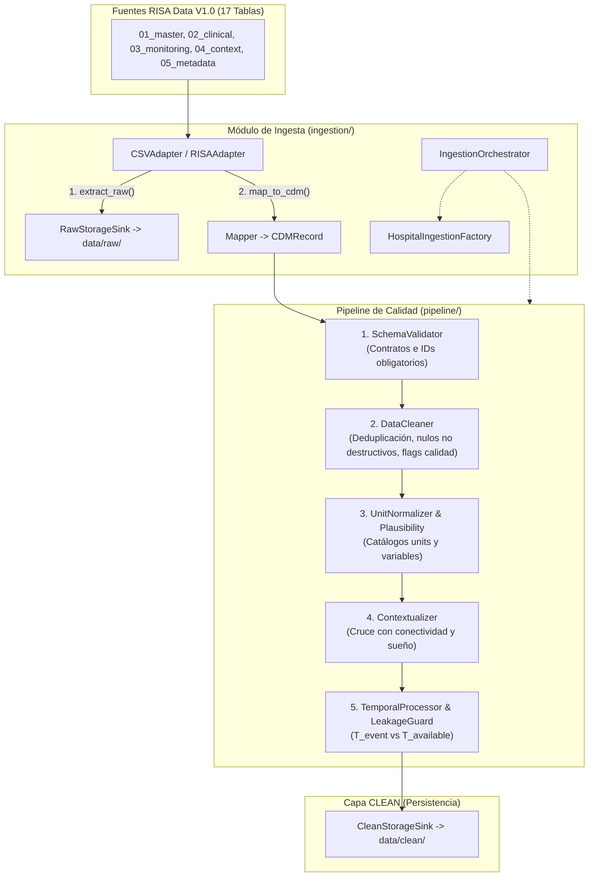

# Plan de Implementación: Sistema de Ingesta y Calidad de Datos (RISA Data V1.0)

**Proyecto:** HealthSignal LATAM — Red Integrada de Salud Avanzada  
**Documento:** `04_Plan_Implementacion_Ingesta.md`  
**Estado:** Plan Técnico Oficial de Ingesta y Calidad de Datos  

---

## 1. Directrices Fundamentales de Calidad de Datos

Este plan implementa un sistema robusto de ingesta y normalización de datos considerando las particularidades y retos de calidad de **RISA Data V1.0**:

1. **RISA no es un dataset limpio por diseño**: La limpieza y detección de inconsistencias forma parte esencial del problema analítico.
2. **Missingness no es Cero ni Normal**:
   - Un valor faltante (`None` / `NaN`) nunca se sobreescribe como `0` ni como la media sin justificación.
   - Cada registro en el Common Data Model (CDM) mantiene el flag `is_observed = True/False`. Si en fases analíticas posteriores se imputa un valor, se documentará el método (`imputation_method`) y se diferenciará siempre el dato observado del estimado.
3. **Control de Ruido, Artefactos y Retransmisiones**:
   - Detección de registros duplicados y retransmisiones (`MONITOR_RETRANSMIT`).
   - Evaluación y ponderación de flags de calidad (`quality_flag != 'OK'`, `measurement_quality != 'OK'` y `SIGNAL_QUALITY_INDEX < 0.85`).
4. **Validación de Unidades y Plausibilidad Biológica**:
   - Conversión dinámica mediante `units_catalog.csv` (ej. `degF` $\rightarrow$ `degC`).
   - Validación contra rangos plausibles en `variable_catalog.csv` (ej. HR: 20-220 bpm, SpO2: 50-100%).
5. **Contexto Operativo vs Clínico**:
   - Cruce con `patient_context.csv` (sueño/actividad) y `connectivity_events.csv` (`DISCONNECTED`, `packet_loss_estimate`) para discernir entre caída de red y deterioro clínico.
6. **Prevención Estricta de Fuga Temporal (*Temporal Leakage*)**:
   - Separación formal de $T_{\text{event}}$ (`sample_datetime`, `timestamp`) y $T_{\text{available}}$ (`result_datetime`, `sync_datetime`).
   - Validación estricta de la regla de oro: $T_{\text{available}} \le T_{\text{decision}}$.

---

## 2. Arquitectura de Ingesta y Flujo de Procesamiento



---

## 3. Distribución de Archivos y Responsabilidades

```text
├── Documentación/                        # Guías técnicas y arquitectura oficial
│   ├── 01_Guia_Tecnica_Oficial_Participantes_HealthSignal_LATAM.md
│   ├── 02_Arquitectura_Sistema_Ingesta.md
│   ├── 03_Arquitectura_Base_de_Datos_RISA.md
│   └── 04_Plan_Implementacion_Ingesta.md
├── ingestion/                            # Adaptadores, Fábrica, Modelos y Sinks
│   ├── __init__.py
│   ├── models.py                         # Modelos canónicos RawRecord y CDMRecord
│   ├── base_adapter.py                   # Interfaz abstracta (extract_raw + map_to_cdm)
│   ├── factory.py                        # HospitalIngestionFactory (Registro dinámico)
│   ├── csv_adapter.py                    # RISACSVAdapter (Lector para los 17 CSVs)
│   ├── mock_adapter.py                   # MockAdapter para pruebas sintéticas
│   ├── sinks.py                          # RawStorageSink y CleanStorageSink
│   └── orchestrator.py                   # IngestionOrchestrator
├── pipeline/                             # Pipeline Común de Limpieza y Calidad
│   ├── __init__.py
│   ├── validation.py                     # SchemaValidator (Validación de contratos e IDs)
│   ├── cleaning.py                       # DataCleaner (Deduplicación y control de missingness)
│   ├── normalization.py                  # UnitNormalizer y PlausibilityChecker
│   ├── contextualizer.py                 # Contextualizer (Cruce de sueño y conectividad)
│   ├── temporal.py                       # TemporalProcessor (Alineación de timelines)
│   └── leakage_guard.py                  # LeakageGuard (Anti-temporal leakage)
├── data/
│   ├── raw/                              # Copias inmutables de origen con metadatos
│   ├── clean/                            # Tablas procesadas en formato CDM (Parquet/SQLite)
│   ├── features/                         # Matrices de características derivadas
│   └── catalogs/                         # Catálogos oficiales de unidades y variables
├── tests/
│   ├── test_ingestion.py                 # Pruebas de adaptadores y guardado RAW
│   ├── test_cleaning_and_units.py        # Pruebas de deduplicación, nulos y unidades
│   ├── test_temporal_leakage.py          # Pruebas de control temporal y latencias
│   └── test_end_to_end.py                # Prueba completa del pipeline
└── run_pipeline.py                       # CLI principal de ejecución de ingesta
```

---

## 4. Plan de Ejecución Paso a Paso

1. **Paso 1: Modelos de Datos (`models/`)**
   - Definir `RawRecord` y `CDMRecord` con tipos Pydantic/Dataclass y validaciones.
2. **Paso 2: Componente de Ingesta (`ingestion/`)**
   - Implementar `BaseHospitalAdapter`, `HospitalIngestionFactory`, `RISACSVAdapter`, `RawStorageSink` y `CleanStorageSink`.
3. **Paso 3: Pipeline de Calidad y Limpieza (`pipeline/`)**
   - Implementar `SchemaValidator`, `DataCleaner` (missingness no destructivo), `UnitNormalizer`, `Contextualizer`, `TemporalProcessor` y `LeakageGuard`.
4. **Paso 4: Orquestador y CLI (`run_pipeline.py`)**
   - Integrar los módulos para ejecutar la ingesta de las tablas de RISA hacia `data/raw/` y `data/clean/`.
5. **Paso 5: Suite de Pruebas Automatizadas (`tests/`)**
   - Implementar y ejecutar pruebas de integridad, no destructividad de missingness, conversión de unidades y prevención de fuga temporal.
