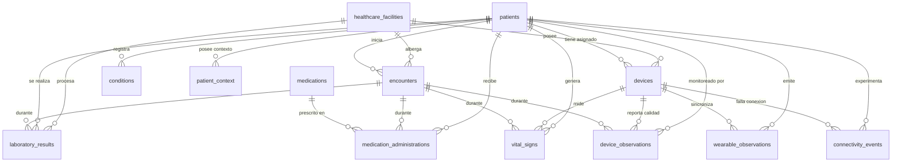

# Especificación del Esquema de Base de Datos PostgreSQL 18 — RISA Data V1.0

**Proyecto:** HealthSignal LATAM — Red Integrada de Salud Avanzada  
**Documento:** `05_Esquema_PostgreSQL_RISA.md`  
**Módulo:** Proceso Independiente de Carga y Esquema Relacional PostgreSQL 18  
**Estado:** Especificación Técnica Oficial  

---

## 1. Resumen y Propósito

Este documento y sus utilidades asociadas constituyen un **proceso independiente y desacoplado** del sistema aplicativo principal. Su propósito es permitir el despliegue de la estructura relacional completa del dataset **RISA Data V1.0** en una instancia de **PostgreSQL 18** y poblarla con los datos originales inmutables de los 17 archivos CSV.

---

## 2. Diagrama Entidad-Relación (ERD PostgreSQL 18)



---

## 3. Especificación de Tablas por Esquema (`risa_raw`)

El script de creación de DDL se ubica en [`scripts/schema_postgresql.sql`](file:///c:/Users/jose/Desktop/Proyectos/Personales/JIDA/UDAPI/scripts/schema_postgresql.sql) y crea las siguientes 17 tablas clasificadas por dominio:

### 3.1 Dominio Maestros (`01_master`)
1. **`healthcare_facilities`**:
   - `facility_id` (`VARCHAR(50)` PK), `facility_name` (`VARCHAR(255)`), `facility_type`, `region_type`, `digital_maturity`, `connectivity_profile`, `monitoring_capability`, `laboratory_capability`.
2. **`patients`**:
   - `patient_id` (`VARCHAR(50)` PK), `sex_at_birth`, `age_years` (`INT`), `age_group`, `region_type`, `care_program`, `baseline_risk_profile`, `enrollment_date` (`DATE`), `active` (`BOOLEAN`).
3. **`devices`**:
   - `device_id` (`VARCHAR(50)` PK), `device_type`, `manufacturer_class`, `model_family`, `measurement_domain`, `sampling_profile`, `reliability_class`, `facility_id` (FK), `patient_assignment_type`, `active` (`BOOLEAN`), `assigned_patient_id` (FK).
4. **`encounters`**:
   - `encounter_id` (`VARCHAR(50)` PK), `patient_id` (FK), `facility_id` (FK), `encounter_type`, `start_datetime` (`TIMESTAMPTZ`), `end_datetime` (`TIMESTAMPTZ`), `care_setting`, `reason_category`, `source_system`, `status`.

### 3.2 Dominio Clínico (`02_clinical`)
5. **`conditions`**:
   - `condition_id` (`VARCHAR(50)` PK), `patient_id` (FK), `condition_category`, `onset_date` (`DATE`), `status`, `severity_context`, `source_system`, `recorded_datetime` (`TIMESTAMPTZ`).
6. **`medications`**:
   - `medication_id` (`VARCHAR(50)` PK), `medication_class`, `generic_category`, `administration_route`.
7. **`medication_administrations`**:
   - `administration_id` (`VARCHAR(50)` PK), `patient_id` (FK), `encounter_id` (FK), `medication_id` (FK), `start_datetime` (`TIMESTAMPTZ`), `end_datetime` (`TIMESTAMPTZ`), `dose_value` (`NUMERIC`), `dose_unit`, `administration_status`, `source_system`.
8. **`laboratory_results`**:
   - `lab_result_id` (`VARCHAR(50)` PK), `patient_id` (FK), `encounter_id` (FK), `test_code`, `test_name`, `result_value` (`NUMERIC`), `unit`, `reference_low` (`NUMERIC`), `reference_high` (`NUMERIC`), `sample_datetime` (`TIMESTAMPTZ`), `result_datetime` (`TIMESTAMPTZ`), `facility_id` (FK), `source_system`, `quality_flag`.

### 3.3 Dominio Monitoreo (`03_monitoring`)
9. **`vital_signs`**:
   - `observation_id` (`VARCHAR(50)` PK), `patient_id` (FK), `encounter_id` (FK), `timestamp` (`TIMESTAMPTZ`), `variable_code`, `value` (`NUMERIC`), `unit`, `device_id` (FK), `source_system`, `quality_flag`.
10. **`wearable_observations`**:
    - `wearable_observation_id` (`VARCHAR(50)` PK), `patient_id` (FK), `device_id` (FK), `timestamp` (`TIMESTAMPTZ`), `variable_code`, `value` (`VARCHAR(100)`), `unit`, `measurement_quality`, `sync_datetime` (`TIMESTAMPTZ`).
11. **`device_observations`**:
    - `device_observation_id` (`VARCHAR(50)` PK), `patient_id` (FK), `encounter_id` (FK), `device_id` (FK), `timestamp` (`TIMESTAMPTZ`), `variable_code`, `value` (`NUMERIC`), `unit`, `signal_quality` (`NUMERIC`), `source_system`.

### 3.4 Dominio Contexto (`04_context`)
12. **`patient_context`**:
    - `context_id` (`VARCHAR(50)` PK), `patient_id` (FK), `start_datetime` (`TIMESTAMPTZ`), `end_datetime` (`TIMESTAMPTZ`), `context_type`, `context_value`, `source`, `confidence` (`NUMERIC`).
13. **`connectivity_events`**:
    - `event_id` (`VARCHAR(50)` PK), `device_id` (FK), `patient_id` (FK), `start_datetime` (`TIMESTAMPTZ`), `end_datetime` (`TIMESTAMPTZ`), `connectivity_status`, `delayed_records` (`INT`), `packet_loss_estimate` (`NUMERIC`).

### 3.5 Dominio Metadatos (`05_metadata`)
14. **`data_dictionary`**: (`file`, `field` PK compuesta).
15. **`source_catalog`**: (`source_system` PK).
16. **`units_catalog`**: (`unit_code` PK).
17. **`variable_catalog`**: (`variable_code` PK).

---

## 4. Guía de Ejecución y Uso de Herramientas

### 4.1 Requisito Previos
Instalar conector PostgreSQL en el entorno Python (opcional si se ejecuta mediante `psql` directo):

```bash
pip install psycopg2-binary
```

### 4.2 Carga de Base de Datos Mediante el Script de Python

El proceso independiente se ejecuta mediante [`scripts/load_risa_to_postgres.py`](file:///c:/Users/jose/Desktop/Proyectos/Personales/JIDA/UDAPI/scripts/load_risa_to_postgres.py):

```bash
# 1. Crear esquema y cargar todos los datos en PostgreSQL 18
python scripts/load_risa_to_postgres.py \
    --host localhost \
    --port 5432 \
    --dbname risa_db \
    --user postgres \
    --password tu_contraseña \
    --create-schema

# 2. Carga en un esquema o base de datos específica
python scripts/load_risa_to_postgres.py \
    --dbname mi_base_datos \
    --schema-name risa_raw \
    --data-dir 01_RISA_DATA_V1_0
```

### 4.3 Carga Directa Mediante Cliente SQL `psql` (CLI de PostgreSQL)

Si prefieres ejecutar directamente el script DDL mediante `psql`:

```bash
# 1. Crear el esquema de tablas en PostgreSQL
psql -h localhost -U postgres -d risa_db -f scripts/schema_postgresql.sql

# 2. Cargar tablas masivas con comando \copy
psql -h localhost -U postgres -d risa_db -c "\copy risa_raw.patients FROM '01_RISA_DATA_V1_0/01_master/patients.csv' WITH (FORMAT csv, HEADER true, ENCODING 'UTF8');"
```
